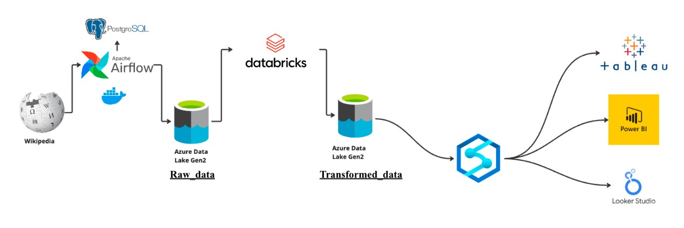
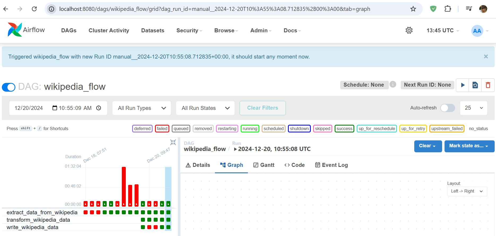
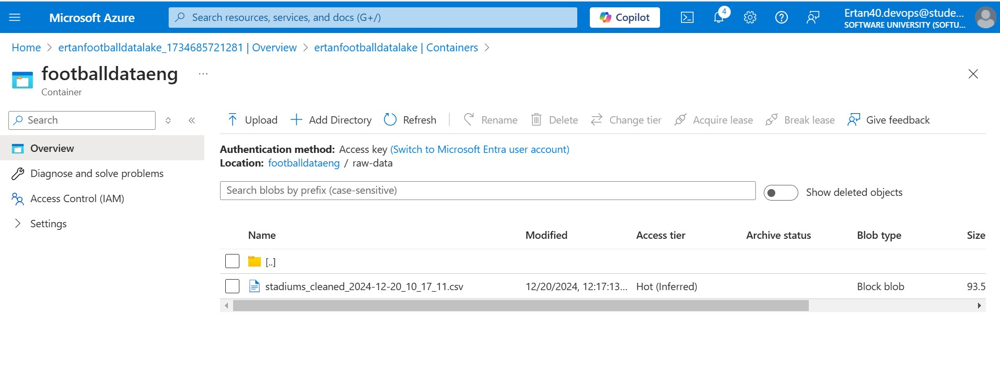
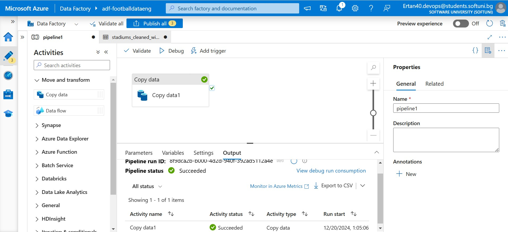
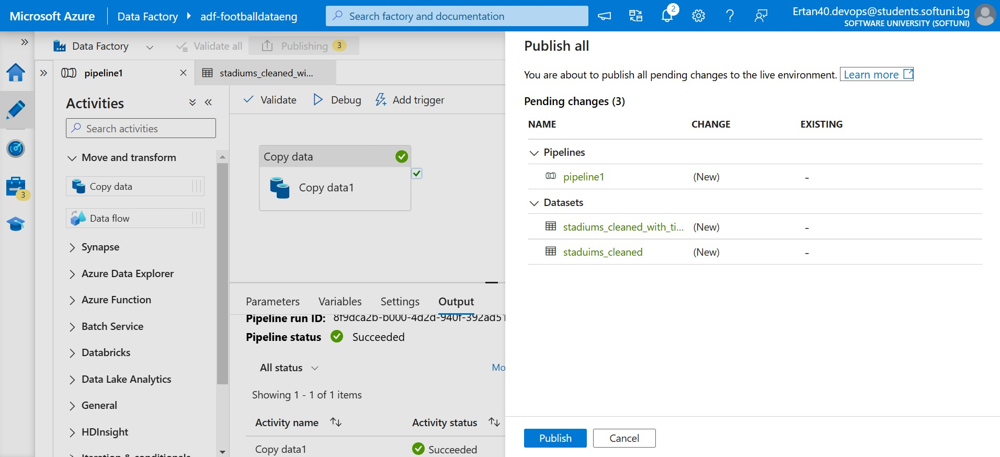
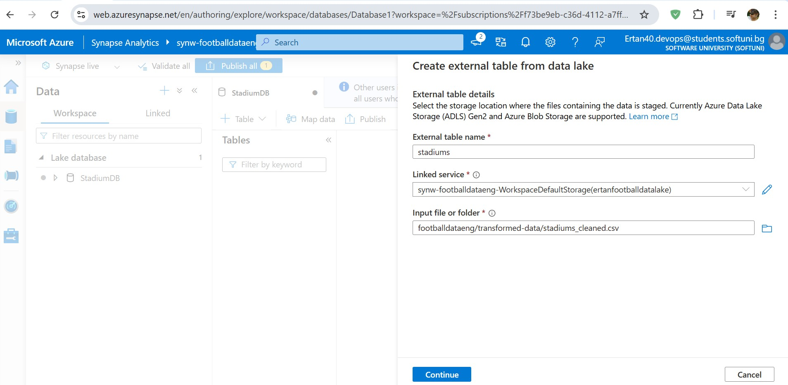
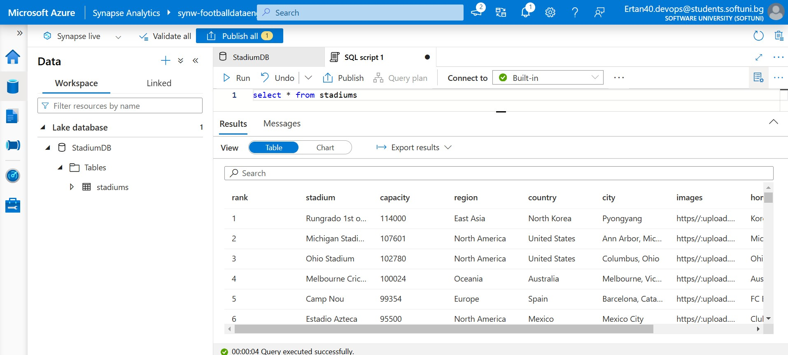
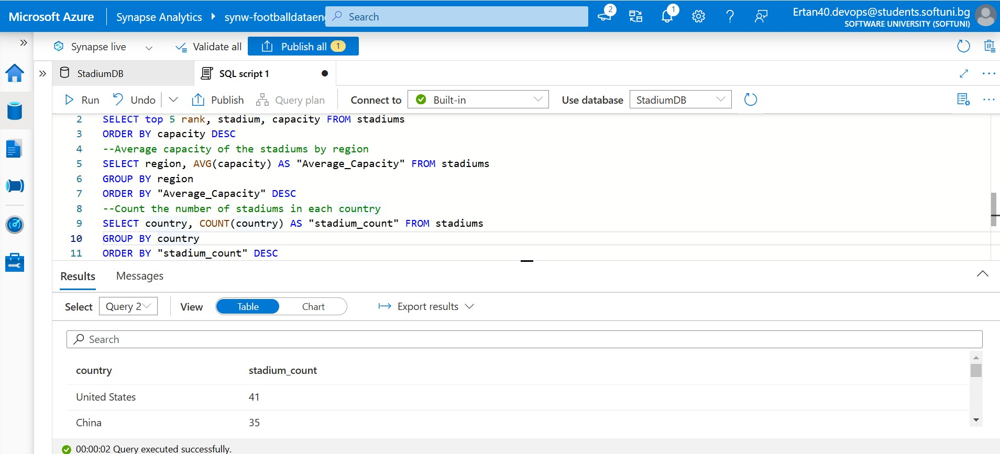
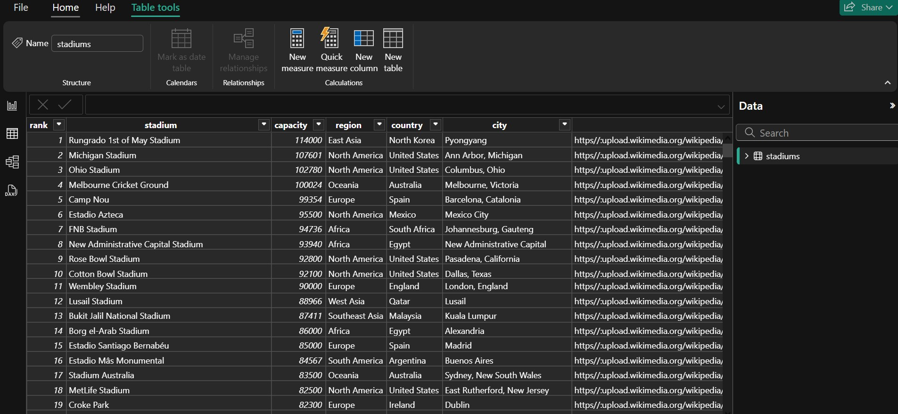
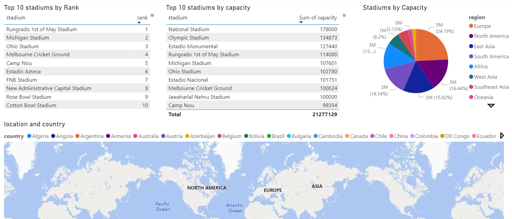

# Football_Data_Analytics_Azure_Data_Eng_Project
 This project involves a complete pipeline for extracting football data from Wikipedia, storing it in Azure Data Lake, transforming the data using Azure Databricks, querying the data through Azure Synapse, and visualizing the results in PowerBI. It's designed to provide comprehensive analytics on football data for enthusiasts and analysts.

1. <b>Architecture Diagram</b>:
    - 

## <ins>Current Environment</ins>
- Docker Desktop
- Apache Airflow
- Azure Data Lake Storage Gen2 account
- Azure Databricks workspace (Optional)
- Azure Synapse Analytics workspace
- Powerbi Desktop or Tableau Desktop

## <ins>1. Extracting Data with Apache Airflow</ins>

1. Files: wikipedia_pipeline.py within the pipelines directory and wikipedia_flow.py within the dags directory.
2. Description: This is the primary DAG file containing the Apache Airflow code.
3. Execution:
   - Run Airflow on localhost.
   - Initiate the DAG to begin data extraction from Wikipedia.
   - Data is subsequently stored in Azure Data Lake Storage Gen2.

- Azure Data Lake Gen 2: Used for storage of data. One container has been created footballdataeng with two folders: raw_data and transformed_data. The initial data ingested through Airflow is transformed to csv format and stored in the raw_data folder. The data in the transformed_data layer is ideal for reporting and analysis. It can be consumed by Azure Synapse Analytics which in turn can be connected to PowerBI for creating visualizations.

## <ins>2. Data Transformation</ins>
Please note that I have skipped that part because my file was pretty cleaned. I copied the file to transformed_data through Data Lake.

 

Anyway you can find below steps - How to transform raw_data through Azure Dataricks: 
Azure Databricks, using PySpark, can be used for these transformations. Data initially stored in csv format in the "raw_data" folder can be converted to the csv format as it progresses to "transformed_data". This transformation can be carried out through Databricks notebooks:

1. Mount the storage.
2. Execute transformation by using the Azure Databricks compute engine.
3. Transform data from "raw_data" to "transformed_data" layer.

## <ins>3. Data Loading and Querying Data with Azure Synapse</ins>
Data from the "transformed_data" folder is loaded into the Business Intelligence reporting application, Power BI. Azure Synapse is used for this purpose. The steps involve:

1. Creating a link from Azure Storage (Transformed_data Folder) to Azure Synapse. Created StadiumDB with stadiums table.
2. Writing stored procedures to extract table information as a SQL view.
3. synapse.sql file contains a collection of SQL queries used for data analysis

  

 

## <ins>4. Data Reporting</ins>
Power BI connects directly to the cloud pipeline using DirectQuery to dynamically update the database. A Power BI report is developed to visualize football dataset data.

Database connected and data loaded

The dashboard within the PowerBI workbook provides an interactive view of the football data. 
Note: Due to an issue with PowerBI, MAP info is not displayed!!

